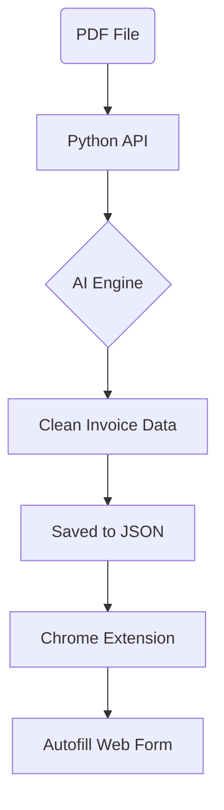

# Invoice Assistant: Simple Build Guide

This guide helps you build the Invoice Assistant step-by-step. It is designed to be easy to follow, even if you are just starting out.

---

## System Design

This flowchart shows how data moves through the system:



---

## Step-by-Step Build Path

Follow these steps in order to build the project from scratch:

### The Foundation (core/config.py)
*   **Purpose**: Manages your AI keys (like OpenAI or Gemini).
*   **Why first?**: The AI needs these keys to "read" your invoices.

### The Memory (core/storage.py)
*   **Purpose**: Saves the extracted data so you don't lose it.
*   **Why second?**: You need a "bucket" to hold the data the AI finds.

### The Brain (core/engine.py)
*   **Purpose**: This is the heart of the system. It turns a PDF into structured information.
*   **Key Logic**: It uses OCR (to read images) and AI (to understand the text).

### The Bridge (api.py)
*   **Purpose**: Connects the Python code to the Chrome Extension.
*   **Location**: Root folder.

### The User Interface (extension/)
*   **Purpose**: The popup buttons in your browser.
*   **What it does**: Lets you upload PDFs and click "Fill" to type data into SAP automatically.

---

## Quick Setup Guide

**1. Install Dependencies**
```bash
pip install -r requirements.txt
```

**2. Setup Keys**
Create a `.env` file in the root and add your API keys.

**3. Run the App**
```bash
python run.py
```

**4. Add to Chrome**
Open `chrome://extensions/` and load the `extension` folder.

---

## Build Summary
Build in this logical order: 
**Config** → **Storage** → **Engine** → **API** → **Extension**

> [!TIP]
> Keep your code clean and flat. A simple design is a powerful design!
