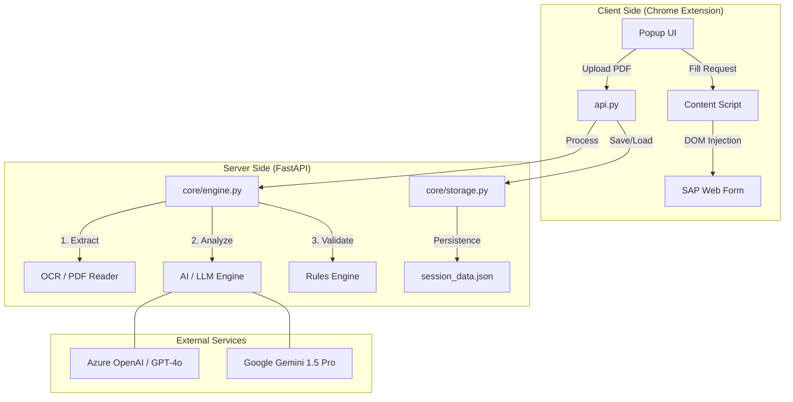

# 🧾 Invoice Assistant: AI-Powered SAP Automation

A production-grade, modular system for extracting invoice data using AI and automating entry into SAP or any web-based form via a Chrome Extension.

---

## 🏗️ System Architecture

The project follows a **Lean Backend + Intelligent UI** architecture.



---

## 🚀 Beginner's Guide: Start From Scratch

Follow this order to build or understand the system step-by-step.

### Step 1: Core Intelligence (`core/engine.py`)
This is the "Brain" of the project.
- **Requirement**: Build a pipeline that takes a PDF and returns structured JSON.
- **Logic**: Use `pypdf` for text, `pytesseract` for OCR backup, and `LangChain` to talk to AI.
- **Key Task**: Create a "Structured Output" schema using Pydantic so the AI always returns valid JSON.

### Step 2: Storage & Session (`core/storage.py`)
Ensures data isn't lost when you close the browser.
- **Requirement**: Save extracted invoices to a file.
- **Logic**: Manage a list of invoices and deduplicate them using a "Composite Key" (Supplier + Invoice Number).

### Step 3: Backend Delivery (`api.py`)
Exposes the core logic to the outside world.
- **Requirement**: Create a Web Server.
- **Logic**: Use `FastAPI` to create endpoints like `/upload` and `/invoices`. This allows the extension to "talk" to the Python backend.

### Step 4: The Intelligent UI (`extension/`)
The interface for the user.
- **Requirement**: A Chrome extension to handle uploads and automate forms.
- **Logic**: 
    - `popup.js`: Communicates with the API.
    - `content.js`: Injects data into SAP form fields by selecting the right HTML IDs.

---

## 🛠️ Quick Setup (Local Environment)

### 1. Prerequisites
- **Python 3.10+**
- **Tesseract-OCR**: [Download here](https://github.com/UB-Mannheim/tesseract/wiki) (Required for image-based PDFs).
- **Poppler**: (Required for PDF conversion).

### 2. Environment Configuration
Create a `.env` file in the root:
```env
# AI Keys (choose one or more)
AZURE_OPENAI_API_KEY=your_key
OPENAI_API_KEY=your_key
GOOGLE_API_KEY=your_key

# Azure Specifics (if using Azure)
AZURE_OPENAI_ENDPOINT=https://xxx.openai.azure.com/
AZURE_OPENAI_DEPLOYMENT_NAME=gpt-4o
AZURE_OPENAI_API_VERSION=2024-02-15-preview
```

### 3. Install Dependencies
```powershell
pip install -r requirements.txt
```

### 4. Run the System
```powershell
python run.py
```

---

## 📂 Project Structure (Refined)

- `core/`: The heart of the system (Engine, Storage, Config).
- `extension/`: The Chrome Extension (UI & Automation).
- `notebook/`: A detailed Jupyter Notebook for testing and guide.
- `api.py`: The main REST API server.
- `run.py`: One-click system launcher.

---

## 🛠️ Tech Stack
- **Backend**: Python, FastAPI, LangChain.
- **AI**: GPT-4o / Gemini 1.5 Pro.
- **Automation**: Javascript (Chrome Scripting API).
- **OCR**: Tesseract, Pdf2Image.
