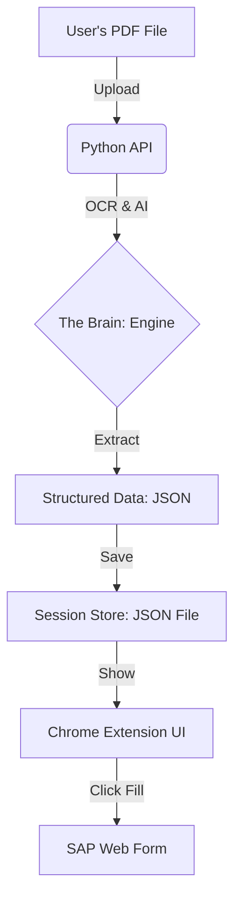

# 🧾 Invoice Assistant: Start Here Guide

This guide is for anyone who wants to build this system from scratch. We keep it simple and direct.

---

## 🏗️ System Design (The Simple View)

This is how the system "thinks" and moves data:



---

## �️ Step-by-Step Build Guide

If you are building this from scratch, follow this exact path:

### 1️⃣ The Foundation (`core/config.py`)
*   **What it does**: Handles your API keys (Azure, OpenAI, or Gemini).
*   **Why first?**: Without keys, the AI cannot "read" anything.

### 2️⃣ The Memory (`core/storage.py`)
*   **What it does**: Saves your data to `session_data.json`.
*   **Why second?**: You need a place to put the data once the AI extracts it. 
*   **Pro Tip**: We use a "Composite Key" (Vendor + Invoice Number) to make sure we never save the same invoice twice.

### 3️⃣ The Brain (`core/engine.py`)
*   **What it does**: This is the most important file. It uses AI to turn a messy PDF into clean data.
*   **File Path**: `invoice_extraction/core/engine.py`

### 4️⃣ The Connector (`api.py`)
*   **What it does**: It's a "Bridge". It lets the Chrome Extension (Frontend) talk to your Python code (Backend).
*   **File Path**: `invoice_extraction/api.py` (In the root folder).

### 5️⃣ The Interface (`extension/`)
*   **What it does**: The buttons you click in Chrome.
*   **Logic**: It sends the PDF to the Connector, gets the data back, and "types" it into SAP for you.

---

## 🚦 How to Start (Quick Setup)

1.  **Install Requirements**:
    ```bash
    pip install -r requirements.txt
    ```
2.  **Add your Keys**:
    Create a `.env` file and paste your OpenAI or Google API keys.
3.  **Run the System**:
    ```bash
    python run.py
    ```
4.  **Load the Extension**:
    Go to `chrome://extensions/` and load the `extension` folder.

---

## 📂 Summary of the Path
To build this, go in this order:
`Config` ➡️ `Storage` ➡️ `Engine` ➡️ `API` ➡️ `Extension`

> [!TIP]
> Always keep your logic simple. If you find yourself making 100 files, stop and use the flattened structure we have here!
