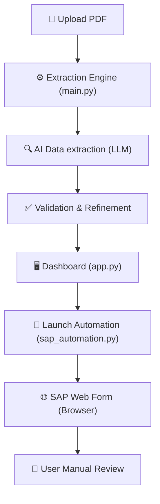

# SAP Invoice Automator: Step-by-Step System Design & Build Guide

This document provides a comprehensive, A-to-Z breakdown of the **SAP Invoice Automator**. It covers the architecture, internal logic, technology stack, and a guide for building this system from scratch.

---

## 1. Executive Summary
The SAP Invoice Automator is an AI-powered RPA (Robotic Process Automation) tool. It uses Large Language Models (LLMs) to extract unstructured data from PDF invoices and automatically populates that data into an SAP web interface using browser automation.

**Goal**: Reduce manual data entry errors and decrease invoice processing time.

---

## 2. System Architecture

The application follows a modular "Pipeline" architecture. Unlike complex agentic frameworks, this system is optimized for **linear speed and reliability**.

### 2.1 High-Level Flow


### 2.2 Component Breakdown
| Component | Responsibility | Key File |
| :--- | :--- | :--- |
| **Frontend (UI)** | Handles file uploads, displays extracted data, and triggers automation. | `app.py` |
| **Extraction Engine** | Extracts text from PDF (Standard or OCR) and uses AI to structure it. | `main.py` |
| **Automation Engine** | Launches a real browser to fill SAP fields based on AI output. | `sap_automation.py` |
| **Config / Secrets** | Stores API keys and environment variables securely. | `.env` |
| **CDP Link** | Connects to existing browsers via Remote Debugging (port 9222). | `sap_automation.py` |

---

## 3. Technology Stack

| Library | Purpose | Why we used it? |
| :--- | :--- | :--- |
| **Streamlit** | Web Interface | Rapidly build data-driven dashboards with Python. |
| **Playwright** | Browser Automation | Safer, faster, and more modern than Selenium for dynamic web apps like SAP. |
| **LangChain** | AI Integration | Standardized wrapper for OpenAI/Azure/Google LLMs. |
| **Pydantic** | Structured Output | Ensures the AI returns data in a strict JSON format (Supplier, Amount, etc.). |
| **PyPDF / Tesseract** | PDF Processing | Handles both digital (selectable text) and scanned (image-based) PDFs. |
| **asyncio** | Concurrency | Allows non-blocking automation, critical for high-performance apps. |

---

## 4. Deep Dive: How it Works

### 4.1 AI Extraction (main.py)
The engine is split into three decoupled phases for maximum clarity:
1.  **Extract**: Uses `PyPDF` with a Tesseract OCR fallback to get raw text.
2.  **Analyze**: Uses a cached LLM factory to transform raw text into a strict `InvoiceData` Pydantic model.
3.  **Refine**: Performs final validation (e.g., ensuring a posting date exists and logging numeric warnings).

### 4.2 SAP Automation (sap_automation.py)
This modular RPA component uses a **Field Mapping** strategy:
1.  **Semantic Mapping**: Fields are defined in a clean list (Label, Key, IsNumeric), making it trivial to add new fields in seconds.
2.  **Existing Browser Connectivity (CDP)**: The system can optionally connect to an already-open Chrome instance via the Chrome DevTools Protocol. This preserves user logins and avoids window clutter.
3.  **Numeric Data Cleaning**: Before filling fields like "Amount" or "Tax Amount", the system automatically strips currency symbols, commas, and other non-numeric characters to prevent errors in SAP's `<input type="number">` fields.
4.  **Robust Locators**: A two-tier strategy (Playwright Labels -> Holistic XPath) ensures fields are found even in dynamic SAP environments.
5.  **User Hand-off**: The browser intentionally remains active after filling, placing the "Human in the Loop" for final verification.

---

## 5. Build from Scratch Guide (6 Steps)

### Step 1: Project Initialization
Create a folder and set up a virtual environment:
```powershell
mkdir invoice_automator && cd invoice_automator
python -m venv .venv
.venv\Scripts\activate
```

### Step 2: Define the Schema
Create `main.py` and define what you want to extract using Pydantic:
```python
class InvoiceData(BaseModel):
    supplier: str
    amount: str
    # ... other fields
```

### Step 3: Implement AI Extraction
Wrap the LLM call using LangChain and Pydantic:
```python
llm = ChatOpenAI(model="gpt-4o")
structured_llm = llm.with_structured_output(InvoiceData)
result = structured_llm.invoke(raw_text)
```

### Step 4: Add Browser Automation
Use Playwright to find fields and fill them:
```python
async def fill_field(page, label, value):
    await page.get_by_label(label).fill(value)
```

### Step 5: Build the Web UI
Use Streamlit to tie everything together:
```python
if st.button("Automate!"):
    asyncio.run(run_automation(extracted_data, url))
```

### Step 6: Install & Run
```bash
pip install -r requirements.txt
playwright install chromium
streamlit run app.py
```

---

## 6. How to Extend / Improve
- **To add a new field**: 
    1. Add the field to `InvoiceData` in `main.py`.
    2. Add the field to the `fields_to_fill` list in `sap_automation.py`.
- **To support Login**: 
    - Implement the `_handle_login` method in `sap_automation.py` to enter credentials before reaching the invoice form.
- **To improve speed**: 
    - Use a smaller model like `gpt-4o-mini` if the invoice structure is simple.
    - Host common Tesseract training data locally for faster OCR.

---
**Document Version**: 1.0 (Production Ready)
**Author**: Antigravity AI
